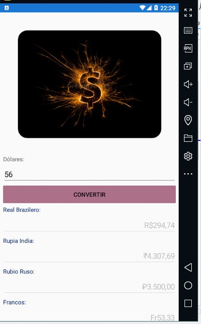
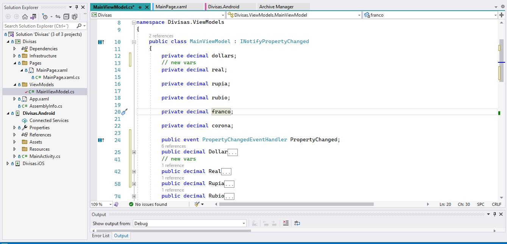
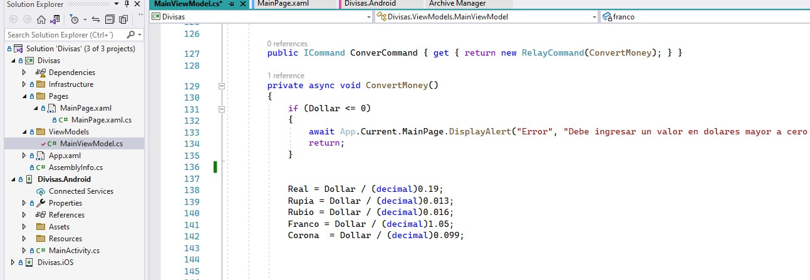
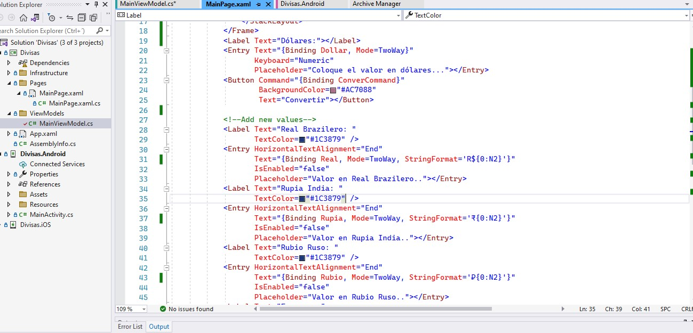

# Converter Currencies :heart:

### Welcome to the Xamarin Project with a converter of currencies

##### 1. Create a model where we create currencies and according to the main currency ($).

##### 2. Design the model where we need to converter all currencies 

##### 3. Then we are going to put the text for each part of the model view

###### Integrants:
###### Erick Andrade 
